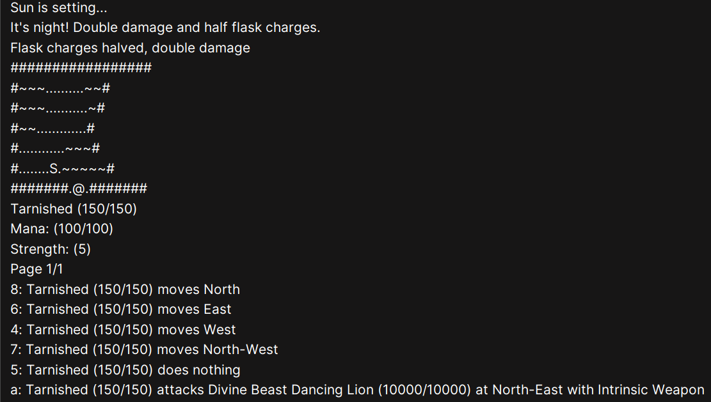
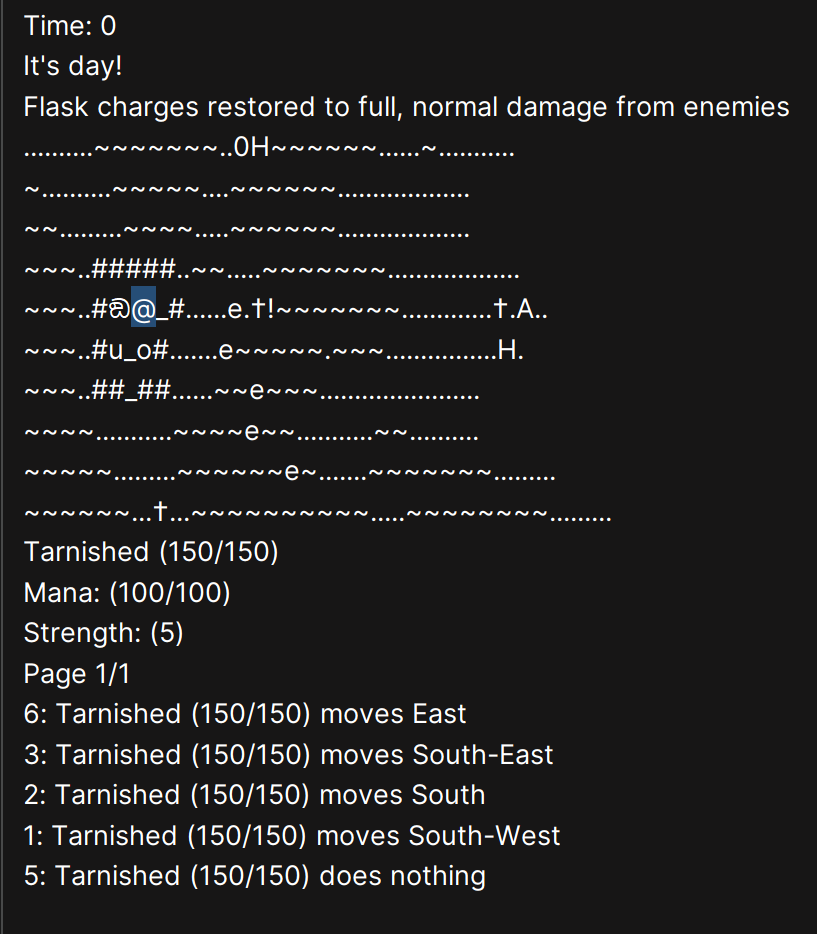

```
`7MM"""YMM  `7MMF'      `7MM"""Yb. `7MM"""YMM  `7MN.   `7MF'    MMP""MM""YMM `7MMF'  `7MMF'`7MMF'`7MN.   `7MF' .g8"""bgd  
  MM    `7    MM          MM    `Yb. MM    `7    MMN.    M      P'   MM   `7   MM      MM    MM    MMN.    M .dP'     `M  
  MM   d      MM          MM     `Mb MM   d      M YMb   M           MM        MM      MM    MM    M YMb   M dM'       `  
  MMmmMM      MM          MM      MM MMmmMM      M  `MN. M           MM        MMmmmmmmMM    MM    M  `MN. M MM           
  MM   Y  ,   MM      ,   MM     ,MP MM   Y  ,   M   `MM.M           MM        MM      MM    MM    M   `MM.M MM.    `7MMF'
  MM     ,M   MM     ,M   MM    ,dP' MM     ,M   M     YMM           MM        MM      MM    MM    M     YMM `Mb.     MM  
.JMMmmmmMMM .JMMmmmmMMM .JMMmmmdP' .JMMmmmmMMM .JML.    YM         .JMML.    .JMML.  .JMML..JMML..JML.    YM   `"bmmmdPY  
```

# Mini Elden Ring

This Java project is a text-based rogue-like game developed by a team of four. It employs object-oriented programming (OOP) principles, including abstraction and factory patterns, to enhance code modularity and reusability. The design adheres to SOLID principles, ensuring maintainability and scalability. Wildcard types are used to handle generic collections, promoting flexibility and type safety.





## Instructions:
1. Run `src/game/Application.java` to start the game.
2. Controls will be displayed on the console, use the control keys for movement and interaction.

## Team Members - 4
1. Aaron
2. Sushi (teammate)
3. Kim (teammate)
4. Stanley (teammate)

## Demonstration
#### Implementation of Static Factory Interface for High-level OOP
https://youtu.be/5d4Yph95ipw

## New Elden Thing Mob - **TimeKeeper**
As a spin-off to our very own "elden-ring", we introduce a Day/Night Cycle System into the game. The system divides the day into 
two phases: daytime and nighttime. Enemies deal more damage at night, dealing increased damage. 
The cycle of day and night is each split into 12 ticks, with each tick representing 1 hour. The game 
starts with daytime, and the cycle will continue to alternate between day and night every 12 ticks. At
night, all Enemies will deal double damage to the player, and the charges of the flask (Both used and unused)
will be reduced by half. The charges count will go back to normal at daytime. 
<br> <br>
In addition, a special boss, the Timekeeper, has the ability to manipulate time by shifting between day and night.
gameplay. The Timekeeper resides North of the Gravesite Plains, initially wandering around the map. At day, the Timekeeper
is peaceful, if a player enters the Timekeeper's surroundings, the Timekeeper will run away from the player. However,  
the Timekeeper has a 15% chance to trigger a NighttimeEffect during daytime once the player is within its surroundings,
which changes the time from day to night. Lastly, the Timekeeper is special, and has the ability to enter floors.
<br> <br>
Once a player is within the surroundings of the Timekeeper at night, there are 2 attacks that could occur: The minute
and seconds attack, dealing 30 and 5 damage. The chances of these attacks occuring are 10%, and 50% respectively. There is also
The hour attack, which is dealt once in every 24 ticks. The hour attack will deal a map-wide damage, decrementing the health of **every** actor 
on the map by 30%.
<br> <br>
Fortunately, the Timekeeper is a water-resistant watch! However, everytime the Timekeeper steps on a puddle, there is a 5% chance of 
his inner clock mechanisms malfunctioning, as he is not waterproof. This causes the Timekeeper to die.


This system is implemented using object-oriented principles and incorporates 5 new classes:

i) Time (interface) <br>
ii) TimeState <br>
iii) Daytime (extends TimeState implements Time) <br>
iv) Nighttime (extends TimeState implements Time) <br>
v) NighttimeEffect (extends StatusEffect) <br>
vi) Timekeeper (extends Actor) <br>

It also integrates six components from the existing engine package:

i) Actor <br>
ii) GameMap <br>
iii) StatusEffect <br>
iv) Display <br>
v) Enemy <br>
vi) Action


## UML Diagram and Design Report
Refer to docs/design for the UML diagram and design report for each respective assignment.

## Disclaimer
Monash University holds copyright for code inside the `edu.monash.fit2099` package


## Installation
1. Clone the repository.
2. Open the project in your preferred IDE.
3. Run `src/game/Application.java`.

## Usage
- Use the control keys displayed on the console for movement and interaction.

## Contributing _(disabled)_
1. Fork the repository.
2. Create a new branch (`git checkout -b feature-branch`).
3. Commit your changes (`git commit -m 'Add some feature'`).
4. Push to the branch (`git push origin feature-branch`).
5. Open a Pull Request.
